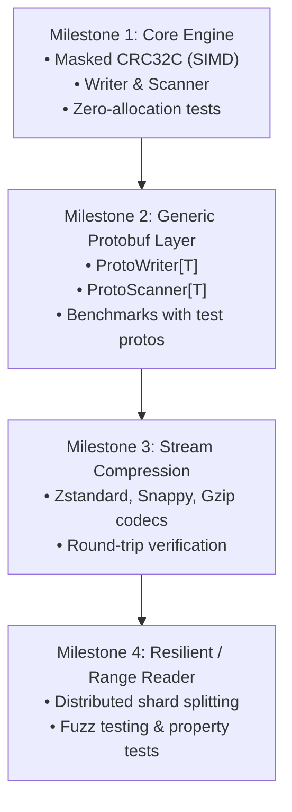

# RecordIO Go Library Design

**Status:** Draft — 2026-08-20 — v0

## Problem

Streaming large volumes of structured binary records (most notably serialized Protocol Buffers) is a fundamental primitive across data pipelines, write-ahead logs (WAL), training datasets, and distributed batch processing.

Standard record serialization formats face three conflicting constraints:
1. **Data Integrity vs Throughput:** Records must be individually validated against bit-rot and network/disk corruption without paying a devastating CPU penalty on checksum calculation.
2. **Streaming vs Memory Footprint:** Applications must stream multi-gigabyte or terabyte files record-by-record with a bounded, constant memory profile (O(1) heap allocation).
3. **Format Interoperability vs Ergonomics:** Storage formats must remain byte-payload agnostic and wire-compatible with standard ecosystems (e.g. TensorFlow TFRecord / RecordIO framing), while application code requires strongly-typed, ergonomic APIs with zero serialization overhead.

This document defines the architecture, wire format, memory model, and public Go API for a high-performance, zero-allocation **RecordIO** library in Go.

---

## Goals

- **Zero-Allocation Hot Path:** Achieve 0 B/op and 0 allocs/op in steady-state record writing and sequential scanning.
- **Standard Framing Compatibility:** Comply strictly with the canonical RecordIO / TFRecord framing specification (16-byte framing overhead with Little-Endian uint64 length and masked CRC32C checksums).
- **First-Class Protobuf Integration:** Provide type-safe generic wrappers (`ProtoWriter[T]`, `ProtoScanner[T]`) that marshal directly into pre-allocated write buffers via `proto.MarshalOptions.MarshalAppend`.
- **Hardware-Accelerated Integrity:** Utilize hardware-accelerated CRC32C (SSE4.2 on x86_64, ARMv8 CRC extensions on aarch64) via `hash/crc32` with Castagnoli polynomial.
- **Idiomatic Go API:** Expose both a high-level `bufio.Scanner`-style iterator and low-level stream primitives (`io.Reader`, `io.Writer`, `io.Seeker`).
- **Layered Extensibility:** Support pluggable stream-level and chunk-level compression (Zstd, Snappy, Gzip) without compromising core zero-copy semantics.

---

## Non-Goals

- **Columnar Layouts / SQL Predicate Pushdown:** RecordIO is strictly a sequential, row-oriented binary streaming format. Columnar projection (Parquet, ORC, Arrow) is out of scope.
- **In-Place Updates:** RecordIO files are append-only. Mutation requires rewriting or compaction.
- **Distributed Coordination:** The library provides single-stream / range readers; cluster-level partition assignment is handled by the calling orchestration system.

---

## 1. Wire Format & Framing Specification

The canonical RecordIO framing encapsulates variable-length binary payloads with separate header and payload checksums to allow early corruption detection.

### Binary Layout

```text
+-----------------------+-----------------------------+-----------------------------------+-----------------------------+
| uint64: Length (8B)   | uint32: Masked CRC32C (4B)  | byte[]: Data Payload (Length B)   | uint32: Masked CRC32C (4B)  |
| Little-Endian         | Little-Endian               | Raw byte stream                   | Little-Endian               |
+-----------------------+-----------------------------+-----------------------------------+-----------------------------+
|<--------------------- Header: 12 Bytes -------------------->|<----------- Payload ------------->|<---- Footer: 4 Bytes ----->|
```

Every record adds exactly **16 bytes** of framing overhead.

### Field Definitions

| Field | Type | Size | Endianness | Description |
| :--- | :--- | :--- | :--- | :--- |
| `Length` | `uint64` | 8 bytes | Little-Endian | Byte length $N$ of the subsequent data payload. |
| `LengthCRC` | `uint32` | 4 bytes | Little-Endian | Masked CRC32C checksum computed over the 8-byte `Length`. |
| `Data` | `[]byte` | $N$ bytes | N/A | Raw payload bytes (e.g. serialized protobuf). |
| `DataCRC` | `uint32` | 4 bytes | Little-Endian | Masked CRC32C checksum computed over the $N$-byte `Data`. |

### Masked CRC32C Algorithm

RecordIO uses the Castagnoli polynomial ($0x82F63B78$) masked via bit rotation and constant addition. Masking prevents checksum collisions with file system signatures and ensures robustness when checksumming data that itself contains CRC values:

$$\text{MaskedCRC}(x) = \left( (x \gg 15) \mid (x \ll 17) \right) + 0\text{xa282ead8} \pmod{2^{32}}$$

$$\text{UnmaskedCRC}(y) = \left( ((y - 0\text{xa282ead8}) \gg 17) \mid ((y - 0\text{xa282ead8}) \ll 15) \right) \pmod{2^{32}}$$

---

## 2. Memory Model & Zero-Copy Architecture

In high-throughput systems (10GbE–100GbE ingestion, local NVMe reads at 2–7 GB/s), heap allocations dominate execution profiles, triggering severe Garbage Collection (GC) pauses. The core engine is designed for zero-copy operation.

```text
[ Reader / OS File ]
       │
       ▼ (Sequential read)
┌──────────────────────────────────────────────────────────┐
│ Scanner Internal Ring / Reusable Buffer                  │
│ ┌───────────────┬────────────────────────┬─────────────┐ │
│ │ 12B Header    │ Payload (N bytes)      │ 4B Footer   │ │
│ └───────────────┴───────────┬────────────┴─────────────┘ │
└─────────────────────────────┼────────────────────────────┘
                              │
                    Borrowed Sub-slice: buf[12 : 12+N]
                              │
                              ▼
               ┌─────────────────────────────┐
               │ Caller / Proto Unmarshaler  │  (Zero heap allocs)
               └─────────────────────────────┘
```

### A. Zero-Allocation Write Path

1. **Stack-Allocated Framing Staging:** The 12-byte header and 4-byte footer are serialized into fixed arrays on the stack (`var header [12]byte`, `var footer [4]byte`).
2. **Single Pass I/O:** The writer writes `header[:]`, `payload`, and `footer[:]` into an underlying `bufio.Writer` or vectorized writer, avoiding payload copy or intermediate slice allocation.
3. **`WriteRecordFrom(io.Reader, int64)`:** Allows piping large blobs directly into the stream without holding the full record in memory.

### B. Zero-Allocation Read Path (`Scanner`)

1. **Buffer Reusability:** The `Scanner` owns a single internal backing buffer (`[]byte`) that dynamically grows to fit the largest record encountered, but is reused across every subsequent record.
2. **Sub-slice Borrowing:** `Scanner.Record()` returns a sub-slice pointing directly into the internal buffer:
   - **Contract:** The returned slice is valid **only until the next call to `Scan()`**.
   - **Ownership Escape:** Callers needing to retain the record across iterations must call `Scanner.RecordCopy()`, which explicitly allocates a dedicated copy.
3. **No-Allocation Skip:** `Scanner.Skip()` advances the underlying stream by $(N + 4)$ bytes after validating the header without copying payload bytes into memory.

---

## 3. Go API Surface

### A. Package Organization

```text
recordio/
├── crc.go             # SIMD Castagnoli CRC32C and masking
├── options.go         # Functional options (buffer sizes, validation modes)
├── writer.go          # Low-level and buffered RecordIO writer
├── reader.go          # Low-level Reader (explicit buffer control)
├── scanner.go         # High-level idiomatic iterator (Scanner)
├── proto.go           # Generic ProtoWriter[T] and ProtoScanner[T]
├── compression.go     # Stream-level compression codecs (None, Zstd, Snappy, Gzip)
└── recordio_test.go   # Correctness, fuzzing, and alloc benchmarks
```

### B. Core Writer API

```go
package recordio

import (
    "io"
)

type Writer struct {
    // unexported fields
}

// NewWriter creates a new RecordIO writer with optional configurations.
func NewWriter(w io.Writer, opts ...WriterOption) *Writer

// WriteRecord writes a single binary record with length prefix and CRC checksums.
// Thread-safety: Not safe for concurrent writes; callers synchronize if needed.
func (w *Writer) WriteRecord(record []byte) (int, error)

// WriteRecordFrom streams a record directly from an io.Reader of known length.
func (w *Writer) WriteRecordFrom(r io.Reader, length int64) (int64, error)

// Flush flushes any pending buffered data to the underlying writer.
func (w *Writer) Flush() error

// Close flushes data and closes any wrapped resources.
func (w *Writer) Close() error
```

### C. Core Scanner API

```go
package recordio

import "io"

type Scanner struct {
    // unexported fields
}

// NewScanner creates a new record scanner over an io.Reader.
func NewScanner(r io.Reader, opts ...ScannerOption) *Scanner

// Scan advances the scanner to the next record.
// Returns false on EOF or unrecoverable error.
func (s *Scanner) Scan() bool

// Record returns the most recently scanned record.
// The underlying memory is owned by the Scanner and is overwritten on the next Scan() call.
func (s *Scanner) Record() []byte

// RecordCopy returns a standalone, heap-allocated copy of the current record.
func (s *Scanner) RecordCopy() []byte

// Offset returns the byte offset in the underlying stream where the current record begins.
func (s *Scanner) Offset() int64

// Skip skips the next record without reading its payload into the record buffer.
func (s *Scanner) Skip() bool

// Err returns the first non-EOF error encountered by the scanner.
func (s *Scanner) Err() error
```

### D. Generic Protobuf Layer

```go
package recordio

import (
    "google.golang.org/protobuf/proto"
)

// ProtoWriter writes typed protobuf messages with zero intermediate slice allocations.
type ProtoWriter[T proto.Message] struct {
    writer *Writer
    buf    []byte
    opts   proto.MarshalOptions
}

func NewProtoWriter[T proto.Message](w *Writer, opts ...ProtoOption) *ProtoWriter[T] {
    return &ProtoWriter[T]{
        writer: w,
        buf:    make([]byte, 0, 4096),
        opts:   proto.MarshalOptions{},
    }
}

func (pw *ProtoWriter[T]) Write(msg T) error {
    pw.buf = pw.buf[:0]
    data, err := pw.opts.MarshalAppend(pw.buf, msg)
    if err != nil {
        return err
    }
    pw.buf = data
    _, err = pw.writer.WriteRecord(pw.buf)
    return err
}

// ProtoScanner scans typed protobuf messages directly from a RecordIO stream.
type ProtoScanner[T proto.Message] struct {
    scanner *Scanner
    factory func() T
    current T
    opts    proto.UnmarshalOptions
}

func NewProtoScanner[T proto.Message](s *Scanner, factory func() T) *ProtoScanner[T] {
    return &ProtoScanner[T]{
        scanner: s,
        factory: factory,
    }
}

func (ps *ProtoScanner[T]) Scan() bool {
    if !ps.scanner.Scan() {
        return false
    }
    ps.current = ps.factory()
    return ps.opts.Unmarshal(ps.scanner.Record(), ps.current) == nil
}

func (ps *ProtoScanner[T]) Message() T {
    return ps.current
}

func (ps *ProtoScanner[T]) Err() error {
    return ps.scanner.Err()
}
```

---

## 4. Error Handling & Corruption Semantics

Data integrity failures must be surfaced with precise error types to enable recovery or clean failure logging:

```go
var (
    ErrHeaderCorrupted = errors.New("recordio: header length CRC mismatch")
    ErrDataCorrupted   = errors.New("recordio: payload data CRC mismatch")
    ErrUnexpectedEOF   = errors.New("recordio: unexpected EOF within record")
    ErrRecordTooLarge  = errors.New("recordio: record size exceeds max limit")
)
```

### Corruption Recovery Behavior

1. **Header CRC Mismatch:** If `LengthCRC` does not match the calculated CRC of `Length`, the stream is desynchronized. Readers fail immediately unless configured in resilient scan mode.
2. **Payload CRC Mismatch:** If `DataCRC` fails, the scanner flags `ErrDataCorrupted`. In permissive mode, the scanner can advance by $(N + 4)$ bytes and attempt to read the subsequent record.
3. **Clean EOF vs Truncated Record:** If `io.EOF` occurs on an exact 16-byte boundary between records, `Scan()` returns `false` with `Err() == nil`. If EOF occurs inside a record header or payload, `Err()` reports `ErrUnexpectedEOF`.

---

## 5. Extensibility: Compression Codecs

Compression is designed as an orthogonal layer wrapping the stream or record blocks:

```go
type Codec string

const (
    CompressionNone   Codec = "none"
    CompressionZstd   Codec = "zstd"
    CompressionSnappy Codec = "snappy"
    CompressionGzip   Codec = "gzip"
)
```

Because RecordIO operates over standard `io.Writer` and `io.Reader` interfaces, stream-level compression (e.g. Zstd framing over the entire RecordIO stream) is supported out of the box with zero modifications to framing logic.

---

## 6. Implementation Plan & Milestones



1. **Milestone 1 (Core Zero-Copy Engine):**
   - Implement `crc.go`, `writer.go`, `scanner.go`, `reader.go`.
   - Validate 0 allocs/op with `testing.AllocsPerRun`.
   - Comprehensive test suite covering edge cases (0-byte payload, multi-MB records, truncated files, corrupt checksums).
2. **Milestone 2 (Generic Protobuf Layer):**
   - Implement `proto.go` with generic `ProtoWriter[T]` and `ProtoScanner[T]`.
   - Add integration tests and end-to-end serialization benchmarks.
3. **Milestone 3 (Compression):**
   - Add compression adapters (`klauspost/compress/zstd`, `golang/snappy`, `compress/gzip`).
4. **Milestone 4 (Fuzzing & Hardening):**
   - Native Go fuzz testing (`testing.F`) for parser resilience against malicious or malformed inputs.
